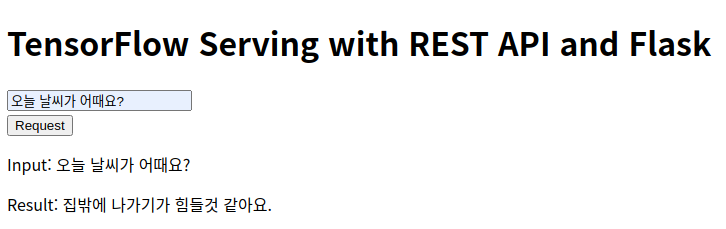
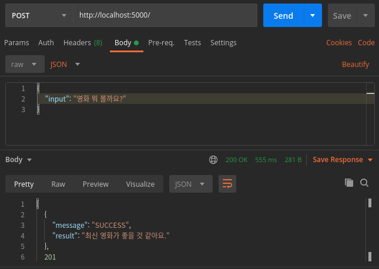

# Transformer Serving with Flask and TensorFlow Serving
Flask allows you to send an input as string format and to receive the prediction as string format.

## Start Flask App
~~~
python app.py
~~~

## Run TensorFlow Serving
Deploy a Korean Transformer chatbot with TensorFlow Serving.

## Screenshots
### Input a sentence and request a prediction

### Send a sentence by using Postman
